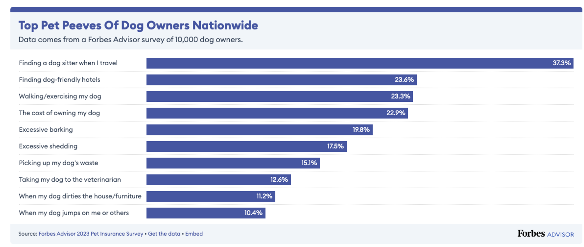
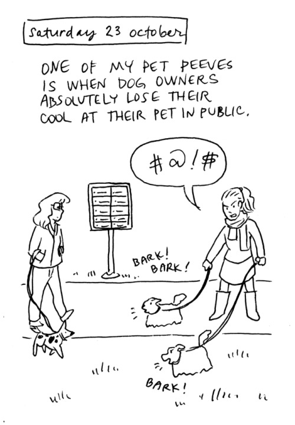

For this exercise I will recreate the graph from Forbes website available here:

[The biggest pet peeves of dog owners nationwide and in each state](https://www.forbes.com/advisor/insurance/pet-insurance-pet-peeves-by-state/)




For breaking the ice, this is one of mine:
{width=40%}

To reproduce this graph first we will import its data file: Top_Pet_Peeves_Of_Dog_Owners_Nationwide.csv

```{r}
library(tidyverse)
library(scales)
```

```{r}
#Read csv file
forbs_data <- read_csv("presentation-exercise/Top_Pet_Peeves_Of_Dog_Owners_Nationwide.csv")

#Clean percentage column
forbs_data <- forbs_data %>%
  mutate(
    percentage = parse_number(`Percentage of respondents`) / 100
  )

colnames(forbs_data)
```


```{r}
#Order rows that shows in the graph:

forbs_data <- forbs_data %>%
  mutate(
    `Pet peeve` = forcats::fct_reorder(`Pet peeve`, percentage)
  )

```


```{r}
#Create the plot:
ggplot(forbs_data, aes(x = percentage, y = `Pet peeve`)) +
  
  # Bars
  geom_col(fill = "#4B5AA7", width = 0.65) +
  
  # Percent labels inside bars
  geom_text(aes(label = percent(percentage, accuracy = 0.1)),
            hjust = 1.05,
            color = "white",
            size = 4,
            fontface = "bold") +
  
  # Remove x-axis scale appearance
  scale_x_continuous(
    limits = c(0, max(forbs_data$percentage) * 1.05),
    expand = c(0, 0)
  ) +
  
  # Titles
  labs(
    title = "Top Pet Peeves Of Dog Owners Nationwide",
    subtitle = "Data comes from a Forbes Advisor survey of 10,000 dog owners.",
    x = NULL,
    y = NULL
  ) +
  
  # Theme styling
  theme_minimal(base_size = 13) +
  theme(
    plot.background = element_rect(fill = "#f2f2f2", color = NA),
    panel.background = element_rect(fill = "#f2f2f2", color = NA),
    
    plot.title = element_text(face = "bold", size = 20, color = "#2c3e50"),
    plot.subtitle = element_text(size = 12, color = "#555555"),
    
    axis.text.x = element_blank(),
    axis.ticks = element_blank(),
    panel.grid.major.x = element_blank(),
    panel.grid.minor = element_blank(),
    
    panel.grid.major.y = element_line(color = "#d9d9d9", size = 0.3)
  )
```