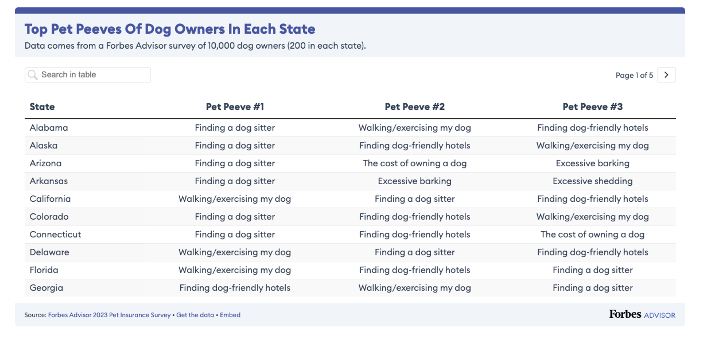

**Part I: Recreating graph"**

For this exercise I will recreate the graph from Forbes website available here:

[The biggest pet peeves of dog owners nationwide and in each state](https://www.forbes.com/advisor/insurance/pet-insurance-pet-peeves-by-state/)


For breaking the ice, here is one of mine:
{width=40%}

To reproduce this graph first we will import its data file: Top_Pet_Peeves_Of_Dog_Owners_Nationwide.csv

```{r}
library(tidyverse)
library(scales)
library(here)
library(patchwork)
```

```{r}
#Read csv file
forbs_data <- read_csv(
  here("presentation-exercise",
       "Top_Pet_Peeves_Of_Dog_Owners_Nationwide.csv")
)

#Clean percentage column
forbs_data <- forbs_data %>%
  mutate(
    percentage = parse_number(`Percentage of respondents`) / 100
  )

colnames(forbs_data)
```


```{r}
#Order rows that shows in the graph:

forbs_data <- forbs_data %>%
  mutate(
    `Pet peeve` = forcats::fct_reorder(`Pet peeve`, percentage)
  )

```


```{r fig.width=14, fig.height=9, out.width="100%"}
#Define Forbes blue
forbes_blue <- "#4E5BA6"


p <- ggplot(forbs_data, aes(x = percentage, y = `Pet peeve`)) +
  
  #Bars
  geom_col(fill = forbes_blue, width = 0.75) +
  
  #Percent labels
  geom_text(aes(label = percent(percentage, accuracy = 0.1)),
            hjust = 1.1,
            color = "white",
            size = 4,
            fontface = "bold") +
  
  #Add breathing space
  scale_x_continuous(
    expand = expansion(mult = c(0.02, 0.15))
  ) +
  
  #Titles
  labs(
    title = "Top Pet Peeves Of Dog Owners Nationwide",
    subtitle = "Data comes from a Forbes Advisor survey of 10,000 dog owners.",
    x = NULL,
    y = NULL
  ) +
  
  #Theme styling
  theme_minimal(base_size = 14) +
  theme(
    plot.background = element_rect(fill = "#F3F4F6", color = NA),
    panel.background = element_rect(fill = "#F3F4F6", color = NA),
    
    plot.title.position = "plot",
    plot.title = element_text(
      face = "bold",
      size = 26,
      color = forbes_blue,
      hjust = 0
    ),
    plot.subtitle = element_text(
      size = 18,
      color = "#6B7785",
      hjust = 0,
      margin = margin(b = 20)
    ),
    
    axis.text.y = element_text(size = 18, color = "#3C4858"),
    axis.text.x = element_blank(),
    axis.ticks = element_blank(),
    
    panel.grid.major.x = element_blank(),
    panel.grid.minor = element_blank(),
    panel.grid.major.y = element_line(
      color = "#DADDE2",
      linewidth = 0.5,
      linetype = "dotted"
    ),
    
    plot.margin = margin(t = 40, r = 40, b = 40, l = 40)
  )

#Making the blue headed bar
top_bar <- ggplot() +
  theme_void() +
  theme(
    plot.background = element_rect(fill = forbes_blue, color = NA)
  )

#Combining the head bar and plot
(top_bar / p) +
  plot_layout(heights = c(0.04, 1))
```

**Part II: Recreating Table**

The table I will recreate is in the same website and represents the top pet peeves of dog owners in each state:



```{r}
library(gt)

state_data <- read_csv(
  here("presentation-exercise",
       "Top_pet_peeves_of_dog_owners_in_each_state.csv")
)

colnames(state_data)
```

```{r}
state_data <- read_csv(
  here("presentation-exercise",
       "Top_pet_peeves_of_dog_owners_in_each_state.csv")
)

colnames(state_data)

state_data <- state_data %>%
  rename(
    state = State,
    pet_peeve_1 = `~~~Pet Peeve #1~~~`,
    pet_peeve_2 = `~~~Pet Peeve #2~~~`,
    pet_peeve_3 = `~~~Pet Peeve #3~~~`
  )
```


```{r}
colnames(state_data) <- c(
  "state",
  "pet_peeve_1",
  "pet_peeve_2",
  "pet_peeve_3"
)

forbes_blue <- "#4E5BA6"

state_table <- state_data %>%
  gt() %>%
  
  cols_label(
    state = "State",
    pet_peeve_1 = "Pet Peeve #1",
    pet_peeve_2 = "Pet Peeve #2",
    pet_peeve_3 = "Pet Peeve #3"
  ) %>%
  
  tab_header(
    title = md("**Top Pet Peeves Of Dog Owners In Each State**"),
    subtitle = "Data comes from a Forbes Advisor survey of 10,000 dog owners (200 in each state)."
  ) %>%
  
  tab_style(
    style = cell_text(
      color = forbes_blue,
      weight = "bold",
      size = "x-large"
    ),
    locations = cells_title(groups = "title")
  ) %>%
  
  tab_style(
    style = list(
      cell_text(weight = "bold"),
      cell_fill(color = "#F3F4F6")
    ),
    locations = cells_column_labels(everything())
  ) %>%
  
  opt_row_striping() %>%
  
  tab_options(
    table.border.top.color = forbes_blue,
    table.border.top.width = px(8),
    table.background.color = "#F3F4F6",
    heading.background.color = "#F3F4F6",
    data_row.padding = px(10)
  ) %>%
  
  #Automatic conditional formatting
  tab_style(
    style = cell_fill(color = "#DCE3F5"),
    locations = cells_body(
      columns = pet_peeve_1,
      rows = pet_peeve_1 == "Finding a dog sitter"
    )
  ) %>%
  
  tab_source_note(
    source_note = md(
      "*Source:* [Forbes Advisor 2023 Pet Insurance Survey](https://www.forbes.com/advisor/insurance/pet-insurance-pet-peeves-by-state/)"
    )
  )

state_table
```

**Some of the prompts used for this exercise:**

_Recreate the figure from this site https://www.forbes.com/advisor/insurance/pet-insurance-pet-peeves-by-state/ more specifically the Top Pet Peeves Of Dog Owners Nationwide, using the csv file already downloaded. csv formatting row example:_
_Pet peeve;	Percentage of respondents;_
_Finding a dog sitter when I travel;	37.34%_
_The graph needs to be generated using R and ggplot2, the graph have a top bar in blue and bold title in blue also._

_For creating interactive footnotes in the table: For the footnotesm I want “[TEXT]” clickable/interactive in the [LOCATION] linking to [URL]. How do I do that?_